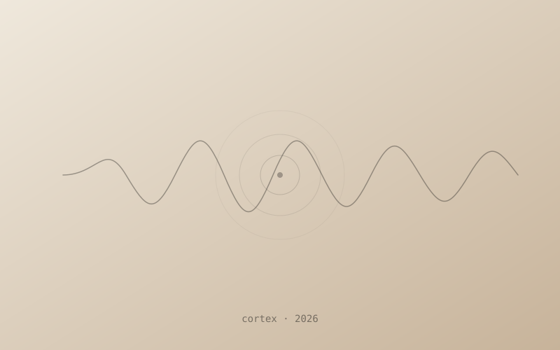

{/*
  Schema lives in src/content.config.ts. Fields only — don't invent new ones.

  • title    — sentence case. Em-dash taglines are idiomatic: "X — tagline".
  • summary  — required one-liner for the archive row.
  • year     — number, not a string.
  • role     — optional ("Product Design", "UX Design", etc.).
  • cover    — optional image; relative path, next to this mdx.
  • external — if set, the archive row links out instead of to a case study.
  • tags     — first tag is "work", then domain tags ("ai", "mobile", "web"…).
  • hero     — exactly ONE project in the whole collection should have this
               true. Don't flip this on without turning the current hero off.
  • draft    — leave true on this template so it stays out of the archive.

  Rich-content notes (see the body):

  • Inline markdown images need the file to exist at build time. The
    example below points at ./covers/cortex.svg which ships in the repo;
    swap it for your own asset and delete the old reference.
  • GIFs, videos, iframes use native HTML with absolute /public paths —
    they won't fail the build if the file is missing, they'll just 404
    in dev until you drop files into the public/ folder.
*/}

## The context

What the project is, who it's for, what problem it was solving. Two or
three sentences — enough to set the stakes without front-loading.

## The moves

— First move. One sentence, past tense.

— Second move. Why it mattered, not just what it was.

— Third move. The one you almost didn't make.

### A still image

Markdown image syntax. Astro auto-optimizes relative paths in MDX and
generates the right `srcset`.



For more control (explicit widths, densities, formats), use Astro's
`Image` component instead. The import must sit at the top of the file,
right after the frontmatter:

```astro
import { Image } from 'astro:assets';
import screen from './images/screen.png';

<Image src={screen} alt="…" widths={[480, 960, 1440]} />
```

### An animated GIF

GIFs aren't run through Astro's image pipeline. Drop them in
`public/gifs/` and reference with a leading slash.

<figure>
  
  <figcaption>The interaction, looped. A GIF is cheaper than a video when the thing is short and quiet.</figcaption>
</figure>

### A video walkthrough

Drop the file in `public/videos/`. Keep clips short and muted-by-default
so autoplay works on mobile. `preload="auto"` starts buffering on page
load so the clip is ready the moment the reader presses play; the
`poster` (its first frame) holds the space until then.

<figure>
  <video
    src="/videos/walkthrough.mp4"
    poster="/videos/walkthrough-poster.jpg"
    controls
    muted
    playsinline
    preload="auto"
  />
  <figcaption>Prototype recorded on device. No cuts.</figcaption>
</figure>

### A line from research

Markdown blockquote. Good for user research quotes, a line from a brief,
or a sentence you want the reader to slow down on.

> I don't need it to do more. I just don't want to think about it
> three times before I trust what it's telling me.
>
> — an interview participant, week two

### The implementation sketch

Fenced code blocks get syntax highlighting via Astro's default Shiki
setup. Use the language tag for color; skip it for plain text.

```tsx
// The compare drawer — sticky, dismissable, never more than three items.
function CompareDrawer({ items }: { items: Product[] }) {
  if (items.length === 0) return null;
  return (
    <aside class="compare-drawer" aria-label="Compare">
      {items.slice(0, 3).map((p) => (
        <CompareCard key={p.id} product={p} />
      ))}
    </aside>
  );
}
```

Inline code like `useState` works with single backticks.

## What I learned

The honest after-the-fact reflection. What surprised you? What would
you do differently? For in-progress work, frame it as *what I'm
learning* and keep it present tense.
