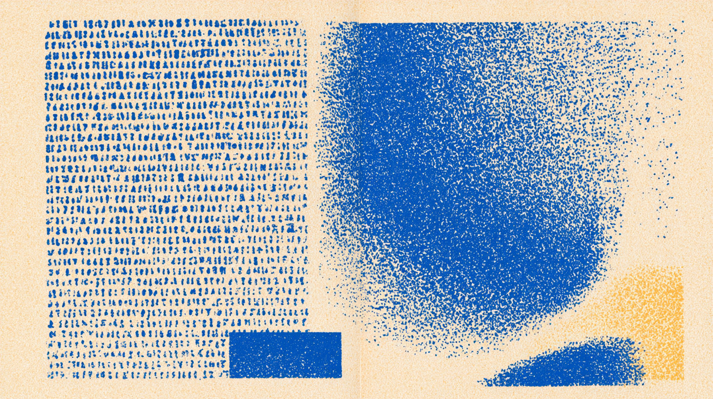
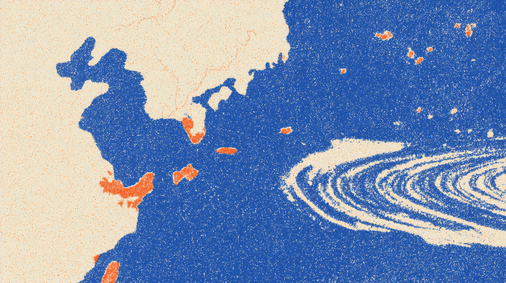

import FileChip from '../../components/FileChip.astro';
import FileReader from '../../components/FileReader.astro';
import RepoChip from '../../components/RepoChip.astro';
import { Content as GapsContent } from '../../assets/feminist-scifi/gaps.md';

## Overview

This is a research-driven interactive web experience that traces the story of
women sci-fi writers across decades and languages. It consists of personal
essays and archive materials that unfold the system behind a piece of
women-produced sci-fi: how it gets translated, classified, published and
awarded. More importantly, what this system leaves out. Sci-fi by women has
long been underrepresented and miscategorized in this male-dominated field;
and once you factor intersectionality, the voice from women of color rarely
reaches the Anglophone readers.

It is an ongoing project. So far: a 76-author dataset, 10 source-language
reconnaissance memos, a cross-recon synthesis, a narrative spec, and a
scroll-driven storybook site. They live in the open at <RepoChip
  repo="Shellwecode/feminist-scifi"
  href="https://github.com/Shellwecode/feminist-scifi"
/>.

## Why I started

I made it for my own curiosity. I wanted to read more of the feminist science
fiction I'd been missing and to understand why I'd been missing it. I was
eight when I first read 张晓风 (Zhang Xiaofeng), at the time filed as an
essayist but whose early work is now recognized as the first piece of
Chinese-language science fiction. Then, in college, I saw translation decide,
in real time, which work got to travel beyond its source language and which
didn't.

### I am curious about

**1. How much of the women's sci-fi has gone absent, untranslated, or filed under a different label?**\
**2. Who draws the genre line, and who gets filed by it?**\
**3. What role does translation play in communicating and preserving the story?**\
**4. What does the map of absence look like?**

## Bias in the dataset

### Phase 1: Individual authors

Phase 1 was per-author research files across 7 regions. I researched 76
authors total, weighted toward Anglophone (29) but spanning East Asian,
African + diaspora, Latin American, European non-English, South Asian, and
MENA writers. I capped the Anglophone canon, and studied how the works
influence each other. In <FileChip
  name="gaps.md"
  lines={107}
  dialog="gaps-reader"
  peek={[
    '# Gaps Inventory — Phase 1 → Phase 2',
    '',
    'An honest record of what is missing,',
    'under-represented, or weakly sourced —',
    'an input to phase 2, not a bug list.',
    '',
    '## Regional gaps',
    '## Thematic gaps',
    '## Translation-metadata gaps',
    '## Influence-edge coverage',
  ]}
/>, I also explicitly documented the exclusion
in the literary world: pre-2000 Brazilian women's SF, the ninety-year South
Asian gap, Korean SF before 1992 — and the "women writers" framing's
exclusion of non-binary writers, flagged as a judgment call still open for
revisiting, not settled.

<FileReader
  id="gaps-reader"
  name="gaps.md"
  lines={107}
  href="https://github.com/Shellwecode/feminist-scifi/blob/main/gaps.md"
>
  <GapsContent />
</FileReader>

### Phase 2: Source-language reconnaissance

Since phase 1 was built on English-language sources, I ran a second research
pass with an inverted methodology from phase 1: source-language venues first,
English only as supported confirmation. I was surprised that around 30% of
the English-language results from phase 1 were inaccurate. For instance, Nora
Naji is actually an Egyptian novelist but not Maghrebi; Sonia Sant'Anna
writes historical novels but not sci-fi. The claim that Chinese women's
novel-length SF is "sparse" is empirically wrong in Chinese.

**The gap here is in the translation pipeline.**

More importantly, the translation gap is not equivalent to writing gap. Six
regions have rich source-language traditions that simply never reached
English. Treating "scarce in English" as "scarce" had been distorting the
whole dataset.

## The recurring form of absence

I thought the source-language approach would have cleared up most of the
inaccuracies, but it only corrected the surface. More structural bias
appears:

**1. The foundational women are filed elsewhere.**

In 8 of 10 regions, the woman closest to a tradition's founding was
catalogued as "literary," "essayist," or "poet", and missed by genre history
entirely. This includes Karin Boye, Dinah Silveira de Queiroz, 張曉風,
Magdalena Mouján Otaño, Buchi Emecheta.

**2. Gendered genre-policing.**

On 晋江, women's speculative writing at massive scale is filed as
言情/仙侠/玄幻, but almost never 科幻. They are excluded from the SF canon by
definition alone. Prestige publishing does it too: Bazterrica's *Cadáver
Exquisito* is *ciencia ficción* in Argentina, "horror" in the US.

**3. Prize asymmetry.**

Germany's Kurd Laßwitz best-novel award: one woman laureate in 45 years.
Recognition skews harder against women than publication does and a prize
rarely comes with a translation budget.

## A more honest narrative

The data naturally revealed a more honest narrative, and I connected them
together.

**Feminist sci-fi is not yet a global conversation but a scattered set of
solitary efforts. The translation lag is closing, but it largely depends on
the named translators' decisions. Behind the scenes, the story of feminist
sci-fi is also a story about the field builders, editors, prize-founders,
translators.**

## Building the site

Three build iterations, each a full working site: a "narrative museum" that
proved the structure, storybook vignettes where vertical scroll drives
horizontal page-turns, and a hand-drawn illustrated study as the opening —
all vanilla HTML/CSS/JS, fully keyboard-navigable, with
`prefers-reduced-motion` fallbacks throughout.

<figure>
  <video
    src="/video/fem-scifi-phase-1.mp4"
    poster="/video/fem-scifi-phase-1-poster.jpg"
    controls
    muted
    playsinline
    preload="auto"
  />
  <figcaption>Phase 1 of the site — the illustrated study, postcard hotspots, and the scroll into the first vignette.</figcaption>
</figure>

## What I learned

1. **The bias is in the sources, not just the canon.** Building from
   English-language references reproduces the exact exclusions the project
   set out to document. The 30–40% error rate on inherited names is the
   strongest argument I have for source-language-first methodology — and it
   only became visible because Phase 1's assumptions were written down
   explicitly enough to falsify.
2. **Record what you reject.** The "considered and rejected" lists and
   `gaps.md` turned out to be the most intellectually valuable files in the
   repo. The dataset's edges — who's excluded, and by what rule — carry as
   much of the argument as its contents.
3. **Let the data revise the thesis.** The romantic version didn't survive
   contact with the evidence. The honest version — scattered solitaries, an
   Anglo-American crystallization, a conditional and fragile translation
   surge — is a better story *because* it's true.
4. **Absence needs typology.** "Missing" is four different phenomena with
   four different implications. Designing empty rooms with labels was more
   honest — and more affecting — than filling them with weak evidence.
5. **In design, the quiet solution usually wins.** Nearly every visual
   iteration moved from more (washes, outlines, glows, big titles) to less
   (existing tones deepened, a hairline border, a smaller title in the
   corner).

## What's next

- **Phase-2 dataset expansion**: ~115 source-language-verified Tier-1
  candidates across ten regions — a 2–3× expansion, with the new data fields
  the recons demanded.
- **Revisit the framing exclusion**: extend non-binary inclusion to the seven
  flagged writers whose work is central to the feminist-SF conversation.
- **Finish the rooms**: replace placeholder illustrations in the vignettes
  and closing cases; build out the field-builders room.
- **Verify the load-bearing edge**: 钱莉芳's 《天意》 (2004) → Liu Cixin's
  《三体》 — if the verbatim source confirms, a woman's novel is the
  acknowledged precedent for the most famous work in Chinese SF.
