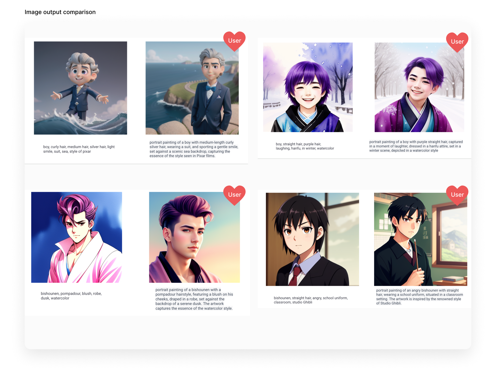
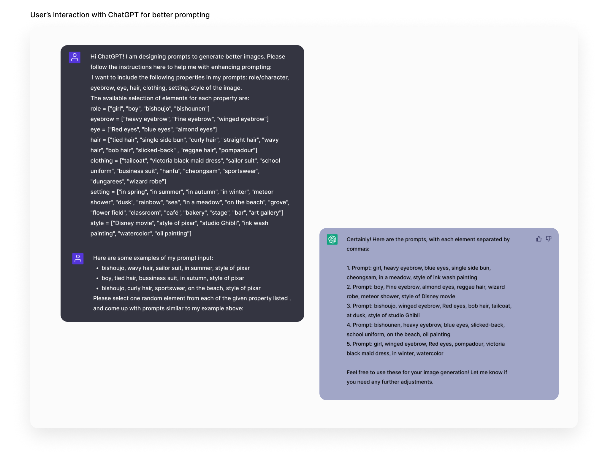
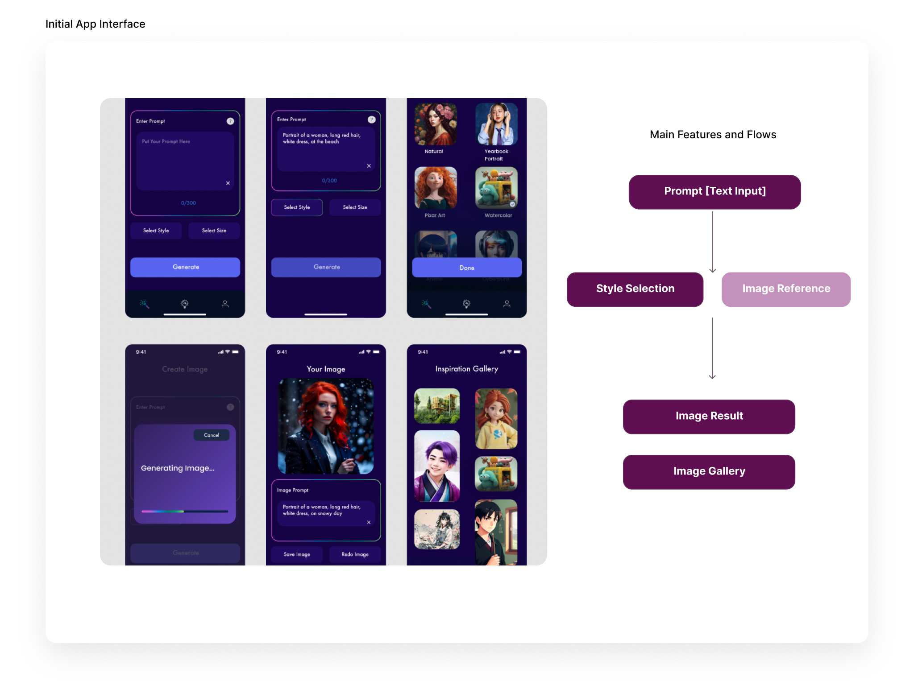
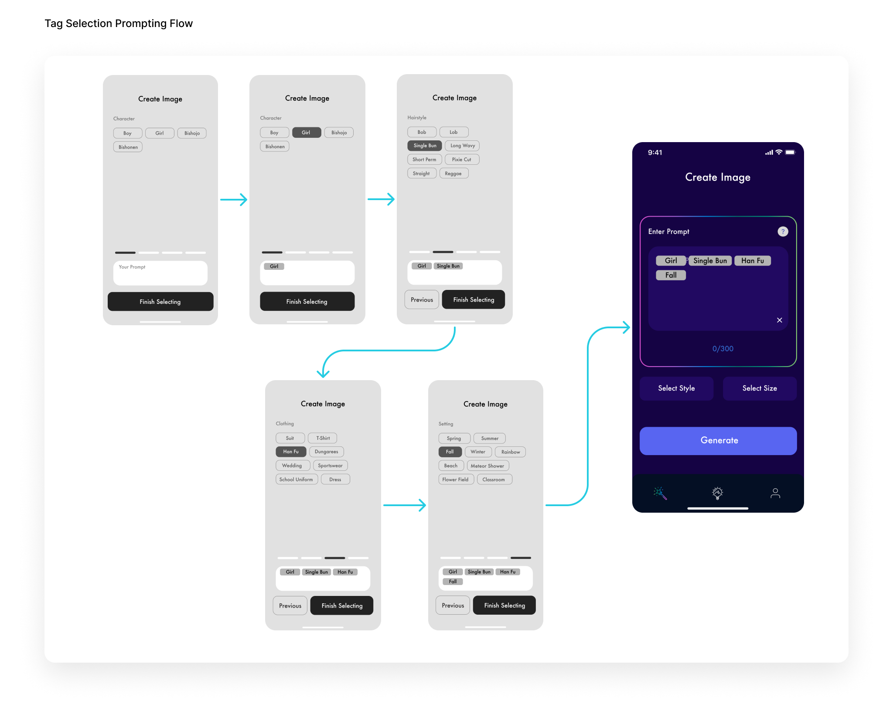
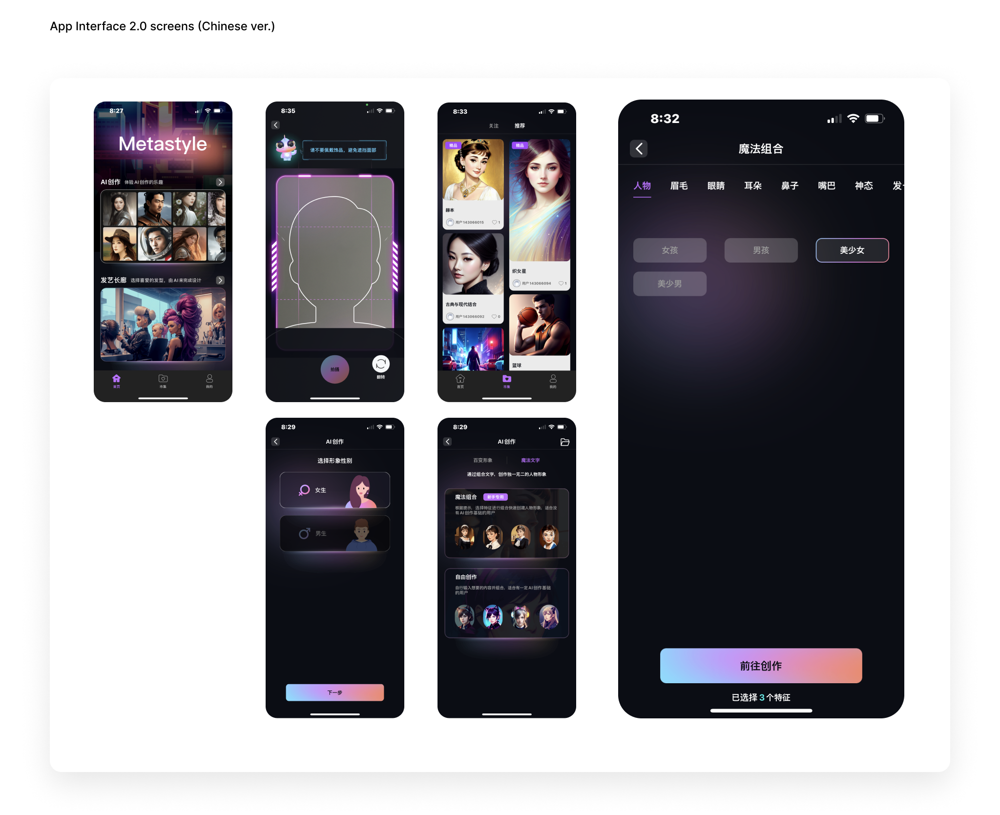

## Overview

MetaStyle is a mobile generative-art app built on Stable Diffusion. I was the
only designer on the team — one PM, two engineers — working as UX designer,
prompt engineer, and researcher across a six-month internship (May–November
2023), in Figma and Miro on the design side, Stable Diffusion and Midjourney
on the model side. The work centered on the two moments that make or break
the app: how people prompt, and what they get back.

## The problem

Three obstacles kept mobile image generation from satisfying anyone:

1. **Text-image alignment.** Prompts failed to accurately depict all the
   attributes people described — the image ignored half the sentence.
2. **The body problem.** Generated images came back with distorted,
   incomplete, or duplicated body parts — hands, notoriously.
3. **Aesthetic dissatisfaction.** Even technically correct outputs deviated
   from what users found beautiful.

## Research

I framed the question as *user aesthetic satisfaction in context*: not "is
the model good," but "does the result match what this person imagined?" I ran
self-analysis across different Stable Diffusion models, prompting experiments
with users, and comparative evaluations of identical prompts in different
phrase formations. ChatGPT integration opened up alternative prompting
methods, so we ran participatory sessions where users refined prompts with
its help and judged the outputs.

Our target users had minimal generative-AI experience, wanted the
interaction *light and fast*, and cared about one thing: results that
matched their conception of attractiveness. We used download likelihood as
the satisfaction metric — if you'd keep it, it worked.

## Design

Stable Diffusion's web interface offers everything; a phone can't. With the
PM I studied existing mobile AI art generators and curated ruthlessly: a
prompting section, style and size selection, the generated output, and an
inspiration gallery — each feature weighed against its impact on engagement.

The bigger move was re-exploring prompting itself. Research showed segmented
short phrases outperformed single words, so we refined the feature tree to
surface only consistently high-performing options as selectable tags —
predefined labels as starting points, with manual input still there for
creative freedom. We also capped how many selections a user can stack, a
system limit that keeps the model inside the range where it performs.
Instead of staring at an empty text box, users compose from labels that are
known to work. Less typing, lower cognitive load, faster to a good image.

## Takeaways

Human-AI interaction is changing the way we design software. Making AI tools
accessible means understanding how users interpret these systems and closing
the expectation gap through the interface. Three prompting lessons I still
use:

- **Start small + large.** Begin with a small/local and a large/global scope
  keyword for a solid base image that generates fast.
- **Longer isn't better.** 5–10 short phrases, comma-separated, beat long
  detailed prompts; prompt length barely correlates with quality.
- **Match subject to style.** Pair subjects and styles that harmonize in
  their level of abstractness — a subject that fights the style's conceptual
  tone loses.
