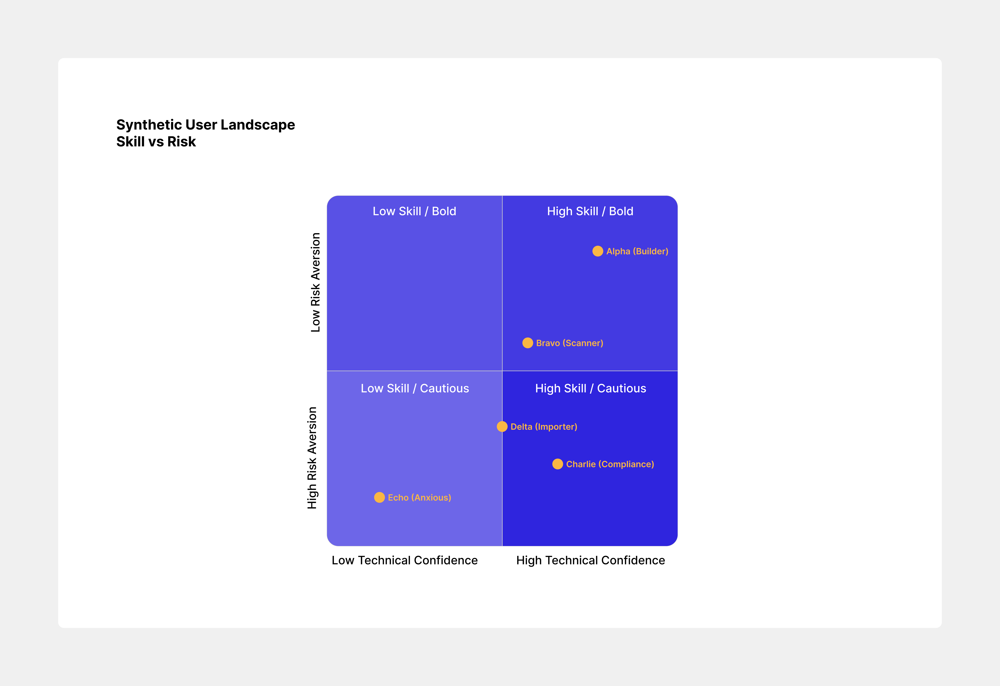
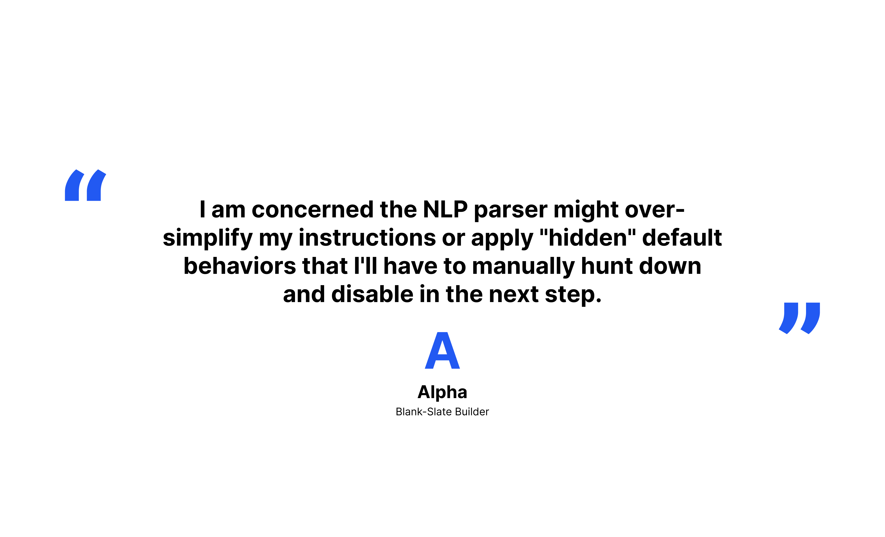
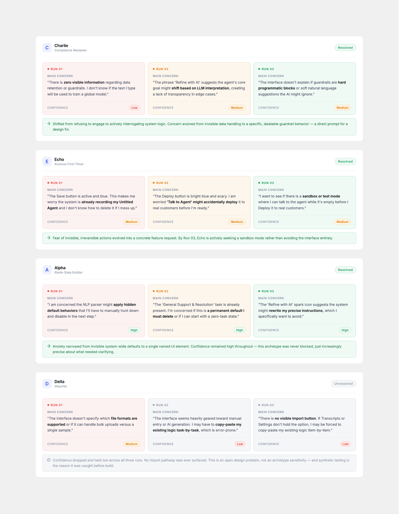

## Overview

This tool actually came out of *Cortex*. While designing it, we iterated so
fast — thanks to AI coding tools — that real user research couldn't keep up
with how quickly we needed to validate design decisions. Our design lead
proposed synthetic user testing as a way to vet concepts early, using AI
archetypes we defined ourselves.

I built it into an internal tool the team now uses across multiple design
decisions, and it's under discussion as a design instrument worth
productizing.

<figure>
  <video
    src="/video/synthetic-ux.mp4"
    controls
    muted
    playsinline
    preload="metadata"
  />
  <figcaption>Using the tool for fast early feedback.</figcaption>
</figure>

## The concept

We built the tool around archetypes, not personas. Personas are claims about
real people; archetypes are calibrated stand-ins for evaluation focus. Each
one has a specific lens — the time-pressed admin, the compliance-cautious
reviewer, the new-to-the-platform builder.

**The tool doesn't pretend to be a user.** It's an instrument for legibility
testing: fast feedback on whether a design *reads* clearly, not a substitute
for what real users will actually do.

The calibration is what separates this from generic LLM critique. Defined
archetypes with defined focus areas produce structured, comparable feedback
that maps to specific design decisions.

## Archetype voices

For Cortex, we calibrated five archetypes along two axes: technical
confidence and risk aversion. The axes came from patterns we'd seen in 1.0
user research; the archetypes themselves were shaped to cover the corners
where designs tend to break.

One output genuinely surprised us — the kind of concern a confident builder
voices: specific, technical, focused on what comes next. That's when the
calibration started to feel real.

## What's next

- **Consistency tests.** Running the same archetype on the same design
  multiple times to measure how stable the feedback is. Where the calibration
  holds, we can trust the tool; where it drifts, we need to know.
- **A/B comparisons.** Same archetype, two design variants, structured
  side-by-side output. Faster than full research when the question is
  directional: does Option A read clearer than Option B?
- **Flow tests.** Most builder work spans multiple screens, not one.
  Extending the tool to evaluate a sequence would close one of the bigger
  gaps.

