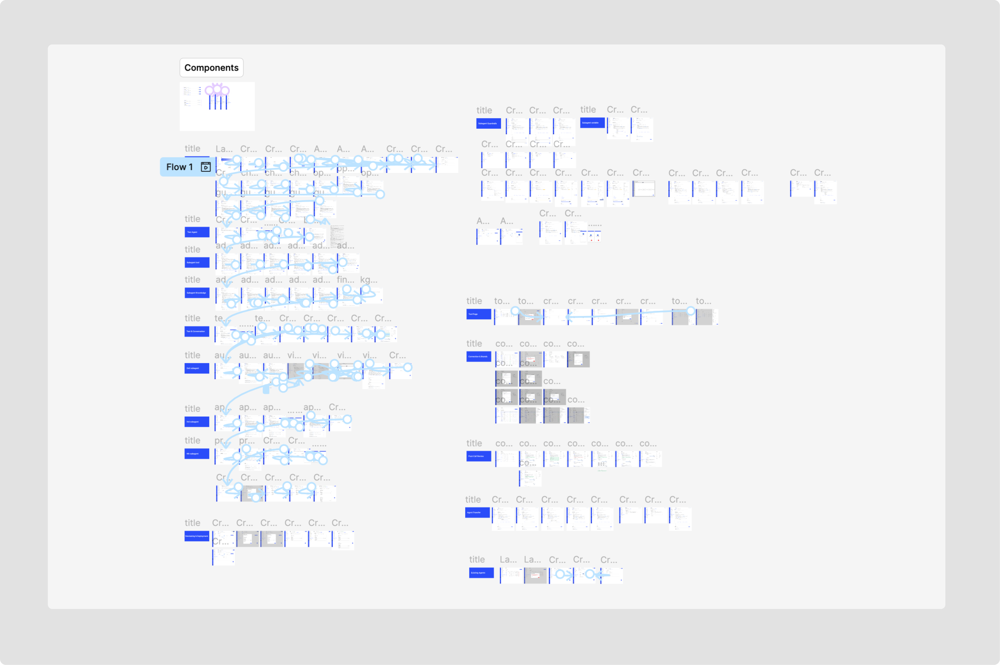
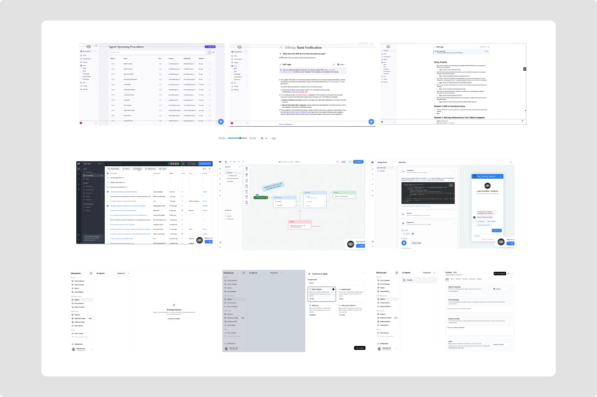
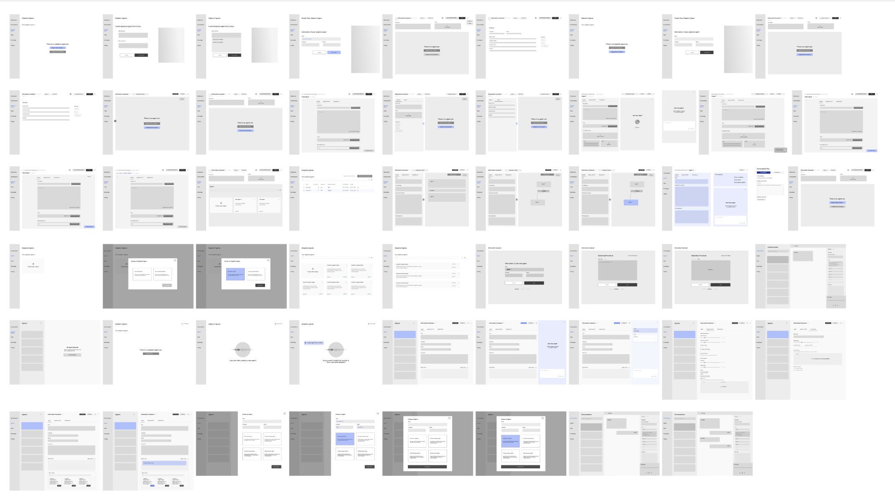
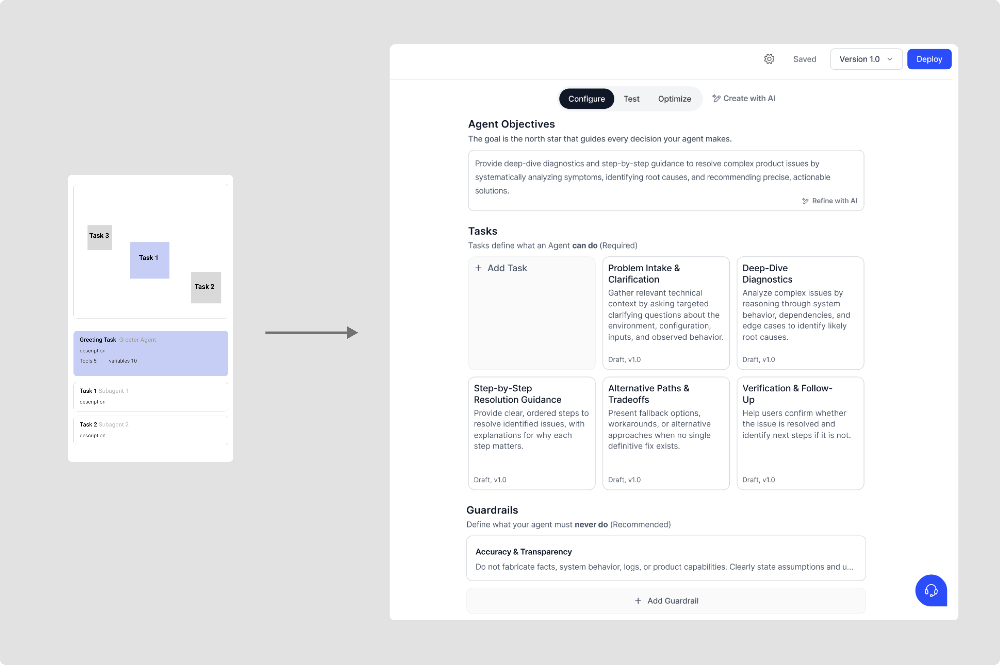
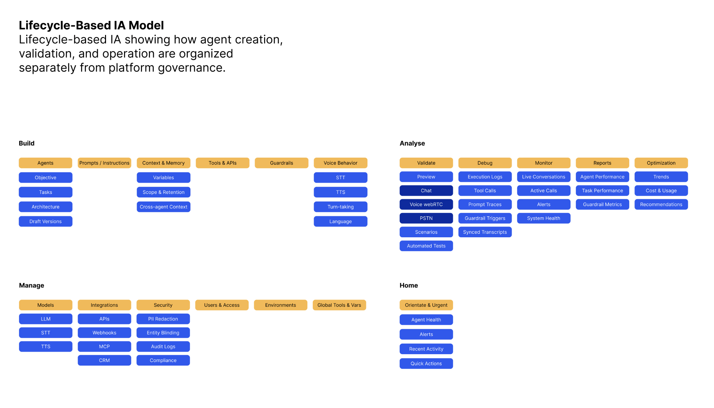

import ScrollStage from '../../components/ScrollStage.astro';
import InViewVideo from '../../components/InViewVideo.astro';

## TL;DR

- **The product.** Five9 Voice AI Agents: an enterprise platform where
  agentic and deterministic voice agents are both first-class. I shipped 1.0
  solo, then partnered with our design lead on the 2.0 rebuild.
- **The turn.** Authoring prompts for voice AI agents is the hardest
  thing we ask of builders. This experience is never linear. You constantly change structures, create new tools as you write. And every prompt is two languages at once: natural language for
  judgment, deterministic flow for what must never vary.
- **The moves.** Rebuild the language (four naming principles) and rebuild the spine (an AI agent lifecycle IA) so the prompt
  stops absorbing structure it was never meant to own. AI drafts at every
  level; the human stays at the helm.
- **How it got built.** Designed in Figma and turned into fully interactive prototype with Claude Code. Everything can be tested
  rather than imagined.
- **The thinking.** How do we keep procedural work simple and reserve agentic capability for where it actually matters?
How do we keep the builder’s intent legible when AI is in the loop?

<InViewVideo
  src="/video/voice-ai-overview.mp4"
  caption="The 2.0 builder, in motion."
/>

## Overview

Voice AI Agents is Five9's enterprise voice agent platform. It's ongoing work, currently in validation.

I shipped the platform's first version on my own. For 2.0, I partnered with
our design lead and ran the research that shaped and validated the new
information architecture and interaction patterns the platform is built on.
Along the way we built design tooling to scale the practice to the whole org. *2 product designers, 3 PMs, 60 engineers*.

### Goal
Design a self-service platform for AI agent builders, where they can choose between autonomous and rule-based behavior, and be given precise control over agent decisions at enterprise scale.

## The problem

Enterprises wanted agentic AI, but every existing solution forced a choice.
Fully agentic systems couldn't meet enterprise standards for trust, governance,
and compliance; fully deterministic systems couldn't adapt to calls that don't
follow a script. Combining the two meant fragmentation and risk. Five9 needed a
platform where both paradigms were first-class.

The timeline for 1.0 was tight and I was the only designer when we started. It was, in the most literal sense, built on the
engineering architecture: the interface named the system's parts but not how the
builder should work.

Two problems surfaced after launch:

1. **The terminology was a wall.** For instance, the old version used different terms for what users experienced as the same thing. They pointed to
   slightly different technical concepts, but users couldn't tell them apart.
2. **The mental model didn't form.** 1.0 never communicated the system
   hierarchy early or clearly enough. Users understood the idea but couldn't
   internalize it. The product complicated the system.

## Research

I spent the weeks after launch studying what we had shipped and where the gaps
were. I interviewed our forward-deployed engineers who author agent prompts for
customers, and reached out to voice agent builders on online forums to
understand their mental models and how they get a voice agent into production.

I also mapped the market. Most platforms still relied on a single text field
for agent behavior; others leaned into pure flow-based automation. Almost no
one had built a seamless hybrid of the two. Resolving this tension was a
category bet, and it confirmed the 1.0 findings were valid.

Two patterns kept showing up in how builders actually work: they start from
prebuilt templates rather than blank prompts, and they iterate with AI. They use
it to draft, revise, and stress-test their work.

But the sharpest finding was *who* was struggling. The people tripping over 1.0 weren't even newcomers but
solution architects and forward-deployed engineers, the most technical users
we have. That reframed the entire project into one hypothesis:

**If we can't build a voice AI agent builder our most technical users can hold in their heads, how can we ever build one for our usual customers?**

Terminology and mental model stopped being polish problems and became the
critical path. Fix what was blocking the experts, and we'd clear the way for
everyone else. When we started on 2.0, this became
the brief, and it split cleanly in two: rebuild the language, and rebuild the
spine.

## Explorations

### Rebuild the language

I started by annotating our own glossary the way I'd critique a design.
I went through every term a builder would meet on day one, and asked: *Should a user know this? Would a non-technical user have any
idea?* Ten definitions in, I found the pattern: the vocabulary named
the engineering implementation but not the builder's intent.

The critique compressed into four principles that governed every naming
decision in 2.0:

1. **Name user intent, not engineer implementation.** "Finite State Machine"
   described how the system runs, not what the builder is doing. It doesn't
   appear in the product.
2. **One word, one meaning.**
3. **Don't use domain words.** If a term needs a computer-science background
   to parse, it doesn't ship.
4. **Avoid redundancy.** Every synonym a product carries is a concept the
   user has to reconcile.

The same principles rewrote the microcopy. The guardrails panel used to open
with *"Guardrails define constraints applied to agent during runtime."* Now
it opens with *"Rules that govern what your agent can and cannot do."*

### Rebuild the spine

The thesis from 1.0 was clear: builders shouldn't have to author rules,
instructions, and behavior in the same place. The design problem was turning
one big prompt field into a system of scoped, structured configuration
without losing the flexibility builders rely on.

We developed a lifecycle-based IA: configuration mapped to the stages of
building, deploying, and operating an agent. *Configure* holds everything that
defines an agent; *Test* holds everything for testing and debugging. Builders
move between stages without losing their place in the work.

<ScrollStage
  label="Iteration 1"
  beats={[
    {
      src: '/images/voice-ai/lifecycle-overview.png',
      alt: 'The lifecycle tabs — Build, Configure, Test, Optimize',
      line: 'A lifecycle-based architecture.',
    },
    {
      src: '/images/voice-ai/lifecycle-build.png',
      alt: 'The Build tab — describe your agent from the main idea',
      line: '<em>Build</em> starts from the main idea.',
    },
    {
      src: '/images/voice-ai/lifecycle-configure.png',
      alt: 'The Configure tab — tasks, capabilities, steps',
      line: '<em>Configure</em> keeps the details in control.',
    },
    {
      src: '/images/voice-ai/lifecycle-configure.png',
      alt: 'Testing alongside configuration',
      line: '<em>Test</em> keeps the loop going.',
    },
    {
      src: '/images/voice-ai/lifecycle-optimize.png',
      alt: 'The Optimize tab',
      line: '<em>Optimize</em> finishes the loop.',
    },
  ]}
/>

<ScrollStage
  label="Iteration 2"
  beats={[
    {
      src: '/images/voice-ai/helm-1.png',
      alt: 'Create with AI — the chat panel',
      line: '"I rely on AI to write prompts nowadays — I barely start from scratch…" <em>— Solution Architect</em>',
    },
    {
      src: '/images/voice-ai/helm-2.png',
      alt: 'The Build screen with an AI draft in progress',
      line: 'What if AI could help at any stage of agent creation?',
    },
    {
      src: '/images/voice-ai/helm-2.png',
      alt: 'The same Build screen — the tension',
      line: "But we don't want AI to oversimplify the process.",
    },
    {
      src: '/images/voice-ai/helm-3.png',
      alt: 'The builder typing their own prompt alongside the AI draft',
      line: 'Human at the helm.',
    },
    {
      src: '/images/voice-ai/helm-4.png',
      alt: 'Your updates are ready — the builder reviews before applying',
    },
    {
      src: '/images/voice-ai/helm-5.png',
      alt: 'Three new task cards, added with the builder in control',
    },
  ]}
/>

## Design direction

Research showed builders already leaning on AI. Nobody starts a prompt from
scratch anymore. So the question for 2.0 was obvious: what if AI could help
at any stage of agent creation? The counter-question mattered more. We didn't
want AI to oversimplify the process, because an agent whose configuration its
builder can't explain is exactly the trust failure that keeps enterprises
away from agentic AI. The stance we landed on: **human at the helm** — AI
drafts, the builder decides, and every AI-made change stays legible and
reversible.

<InViewVideo
  src="/video/voice-ai-call-opening.mp4"
  caption="A test call, started without leaving the task."
/>

<InViewVideo
  src="/video/voice-ai-editor.mp4"
  caption="The editor — tools, variables, and knowledge dropped inline."
/>

<InViewVideo
  src="/video/voice-ai-lang-setting.mp4"
  caption="Voice and language behavior, configured in place."
/>

Watching builders authoring prompts also changed how I think about the writing
itself: **writing a prompt is not linear.** A prompt reads like a document,
but it describes a conversation and conversations loop, interrupt,
backtrack, and hand off. It's also two languages at once: natural language
for the judgment calls, deterministic flow for the steps that must never
vary. Nobody holds all of that in their head while authoring top to bottom.
Builders draft a fragment, test it, rewrite it, jump between the agent level
and the task level, and come back. A tool that assumes linear authoring
fights its user at every step. So testing runs alongside authoring:
a builder can start a test call while configuring a task to see where it
holds and where it breaks. The build–test–rewrite loop collapses into a
single flow: iterate on one section of a task prompt, test it in isolation,
and trace each outcome back to the configuration choice that caused it.

## Open questions

The work is ongoing, and these are the questions I keep returning to:

- **How do we keep procedural work simple and reserve agentic capability for
  where it actually matters?** The hybrid model presumes you can tell
  automation and agentic apart. But when do the two blur?
- **How do we keep the builder's intent legible when AI is in the loop?** As
  builders iterate with AI, configuration drifts from what they would have
  written alone. When does that become a problem?
- **What can evaluating human agents teach us about evaluating AI agents?**
  Contact centers have spent decades scoring human conversations. How can we transfer the rubrics to our AI agent evals?

