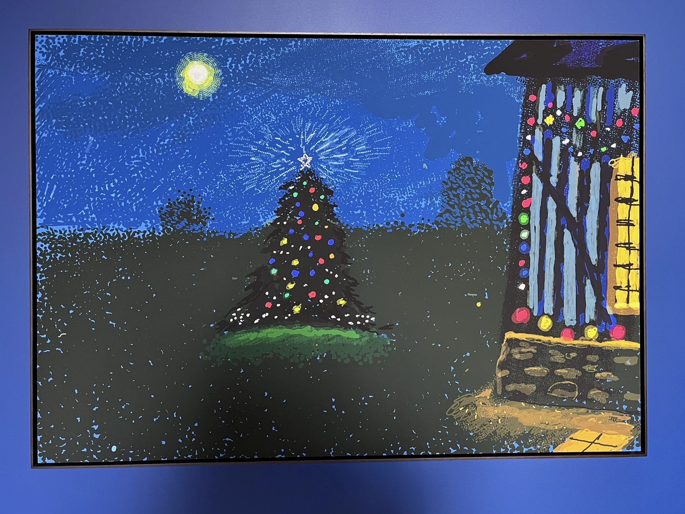

在伦敦时去看了霍克尼的新展，最喜欢他的5th december,
2020。黑夜里的圣诞树，被小彩灯包裹着，在草地上和微弱的月光跳着舞。他对色彩的处理依旧大胆，活泼的高饱和色盘以外，即便是在夜景中，黑色也像在呼吸。仔细看，老爷子虽然用的iPad作画，但他给很多看似重复的笔刷赋予了不同的笔触（脑中忽然浮现出在暖黄灯光里，一块发亮的屏幕前，老爷子对静谧黑暗的好奇注视）。

这幅画正好位于展厅一扇紧闭的门旁，恍然间，画框为这面墙开了一盏窗，沿着它，2020年12月5日那夜圣诞树的点点微光，安静地来到五年后12月3日的伦敦正午里，照在我身上。

2026年的第一天，我望向房间窗外的那棵树时，又看见了它。 新年快乐：）

