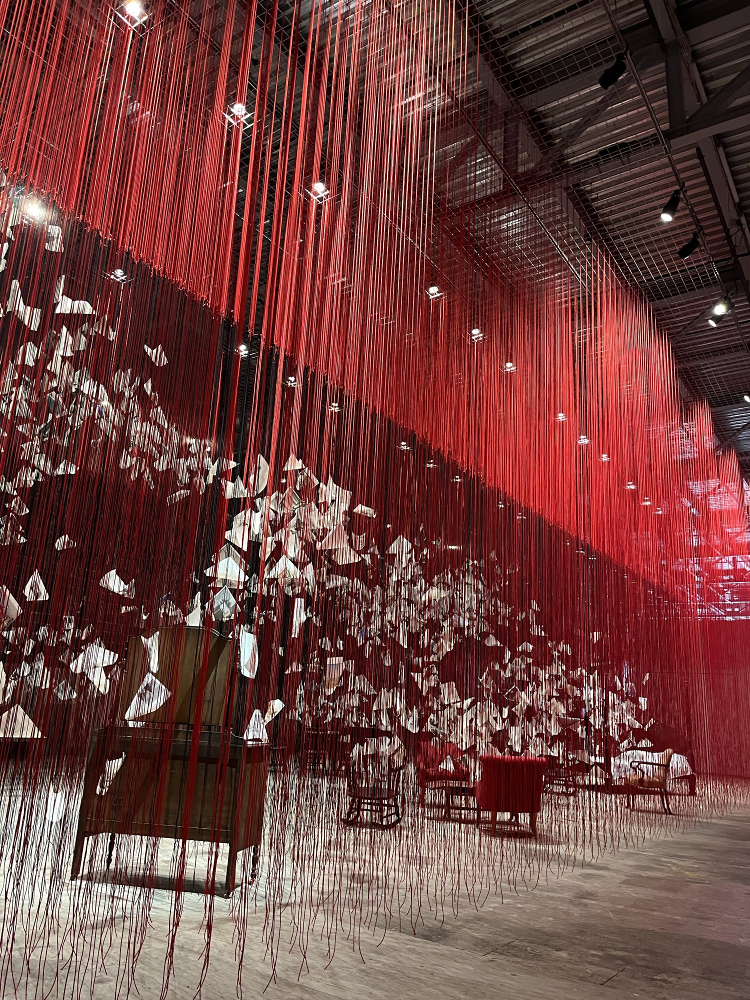
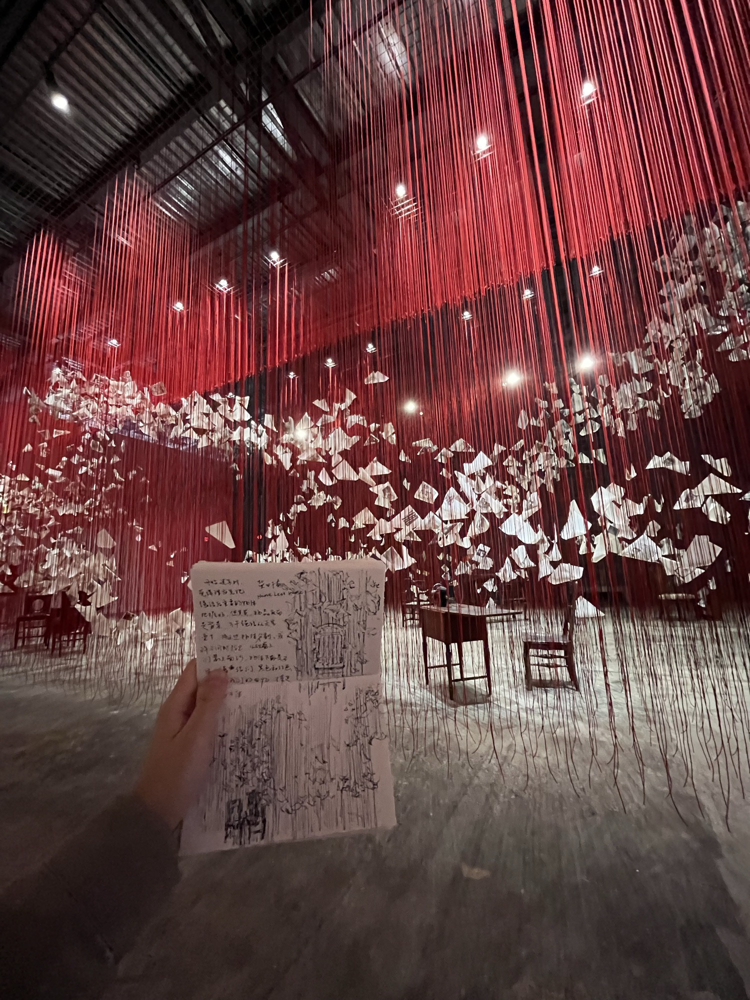
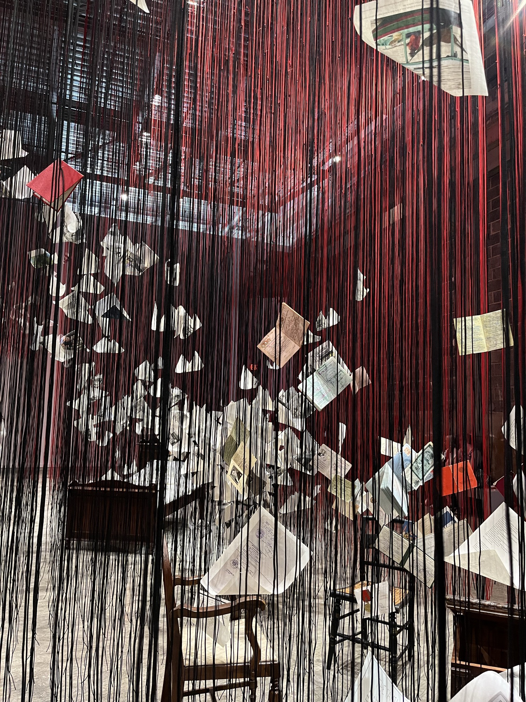

Home Less Home
是盐田千春今年的新作品。这也是沉浸式装置，我穿梭于丝线编织的穹顶下，陈旧的家具、相片和文字漂浮起来，透过丝线细语着”何以为家”。

在一个角落开始速写时，我下意识觉得丝线后的物件是主体，所以理应先把握它们的
形态。当我真正动笔时发现，万千丝线从天空倾泻，把物件们分割、又同时让它们完
整，仿佛丝线才勾勒出物件本身的形状。朱墨色丝线为我们编织记忆，但那些关于
家、关于最初、关于爱的具体时刻也会失真。它们未必有形，当回忆不再是主体，
"去回忆"的冲动会牵引我们感受到恒定。

